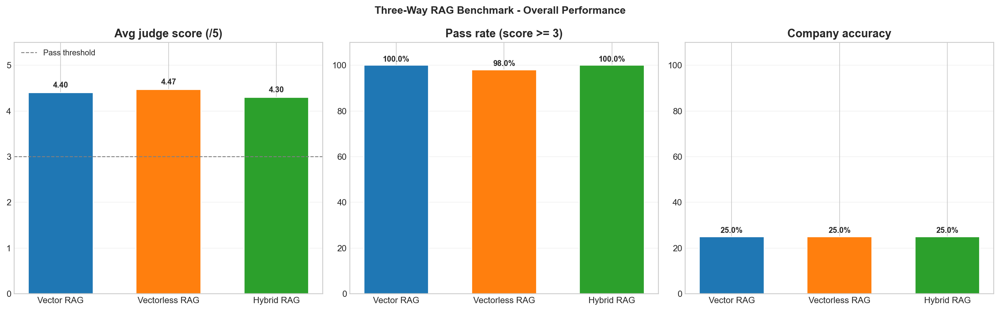
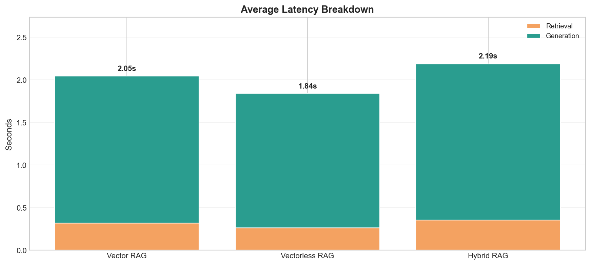
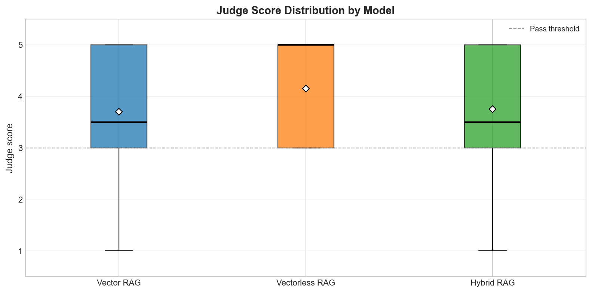
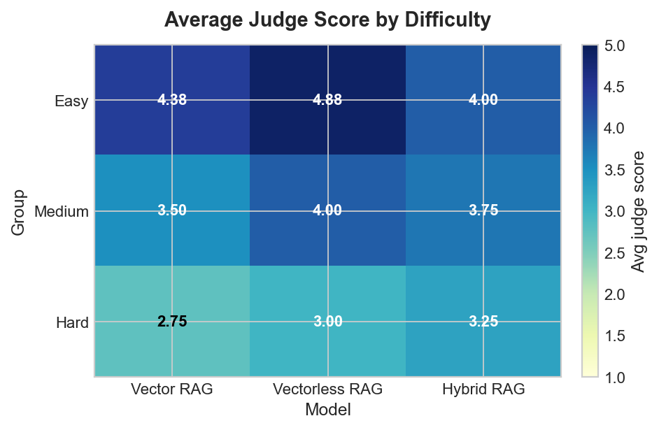
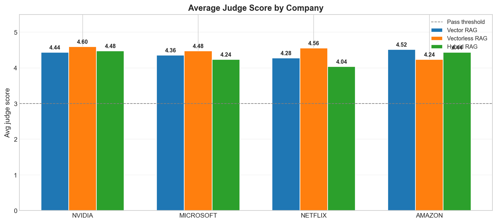
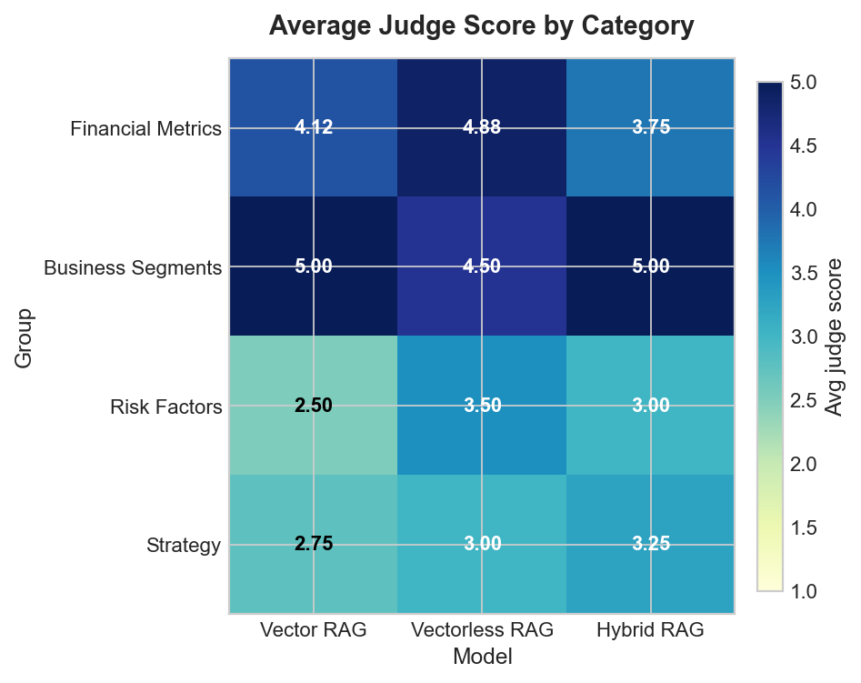

# RAG Benchmark for Financial 10-K Reports

A notebook-first benchmark for comparing three first-stage retrieval strategies over company 10-K annual reports.

- `Vector RAG`: semantic retrieval with BGE embeddings in ChromaDB
- `Vectorless RAG`: lexical retrieval with BM25
- `Hybrid RAG`: reciprocal-rank fusion of Vector and BM25 candidates

All three pipelines share preprocessing, company-aware query cleanup, reranking, and answer generation, so the benchmark focuses on retrieval quality rather than prompt differences.

## Benchmark at a Glance

- 4 public 10-K reports: Amazon, Microsoft, Netflix, and NVIDIA
- 465 raw PDF pages
- 2,467 parent chunks and 8,625 child chunks
- 20 benchmark questions
- 5 questions per company
- 4 category labels
- Difficulty mix: 20 hard

## What This Project Does

This project evaluates whether dense semantic retrieval adds value over a strong keyword baseline for financial 10-K question answering.

It does that by:

- extracting the same PDF corpus into overlapping parent and child chunks
- indexing the child chunks with both ChromaDB embeddings and BM25 keyword search
- using company-aware query preprocessing to target the right annual report
- reranking the top candidates with the same cross-encoder
- generating answers with the same Mistral prompt and model
- scoring the answers with a judge model and saving benchmark CSV files and charts

## Key Design Decisions

- `data_loader.py` hashes PDFs, extracts pages, cleans text, and builds hierarchical parent and child chunks.
- `vector_rag/` indexes child chunks in ChromaDB using `BAAI/bge-base-en-v1.5` and a BGE query prefix.
- `vectorless_rag/` builds a BM25 index over the same child chunks.
- `hybrid_rag/` fuses Vector and BM25 ranked lists with Reciprocal Rank Fusion before reranking.
- `reranker.py` uses `cross-encoder/ms-marco-MiniLM-L-6-v2`.
- `llm.py` formats retrieved context and calls Mistral for answer generation.
- `evaluation/evaluator.py` scores generated answers with a judge model and writes the benchmark outputs.

## How the Methods Differ

Shared across all methods:

- same processed chunks
- same company-aware query preprocessing
- same cross-encoder reranker
- same answer-generation model and prompt

Different first-stage retrieval:

| Method | First stage | Strengths | Tradeoff |
| --- | --- | --- | --- |
| Vector RAG | ChromaDB embeddings with a BGE query prefix | Good at paraphrase-heavy and semantic questions | Slightly slower and can miss exact token matches |
| Vectorless RAG | BM25 keyword search | Best at exact figures, labels, and repeated 10-K phrasing | Can miss broader semantic matches |
| Hybrid RAG | Vector + BM25 with RRF fusion | More robust when both retrievers agree | Adds latency and can add noise when retrievers disagree |

The benchmark is intentionally designed to isolate first-stage retrieval differences while keeping reranking and generation constant.

## Setup

### 1. Create and activate a Python virtual environment

```powershell
python -m venv venv
.\venv\Scripts\Activate.ps1
```

### 2. Install dependencies

```powershell
pip install -r requirements.txt
```

### 3. Create a `.env` file

Create `.env` in the repo root and add:

```env
MISTRAL_API_KEY=your_mistral_generation_key_here
MISTRAL_JUDGE_API_KEY=your_mistral_judge_key_here
HF_TOKEN=your_huggingface_token_here
```

Notes:

- `MISTRAL_API_KEY` is required for answer generation.
- `MISTRAL_JUDGE_API_KEY` is required for evaluation scoring.
- `HF_TOKEN` is optional but recommended for Hugging Face-backed embedding access.

## Running the Project

### Recommended flow

1. Run `notebooks/01_data_exploration.ipynb` to preprocess the PDF corpus and build both indexes.
2. Use `notebooks/02_vector_rag.ipynb` to demo the vector retrieval flow.
3. Use `notebooks/03_vectorless_rag.ipynb` to demo the BM25 retrieval flow.
4. Use `notebooks/04_comparison.ipynb` to compare the two original pipelines.
5. Use `notebooks/05_three_way_comparison.ipynb` to benchmark Vector RAG, Vectorless RAG, and Hybrid RAG together.

### Programmatic usage

Build chunks and indexes:

```python
from data_loader import run_preprocessing_pipeline
from vector_rag.indexer import index_chunks
from vectorless_rag.indexer import build_bm25_index

chunks = run_preprocessing_pipeline()
index_chunks(chunks)
build_bm25_index(chunks)
```

Ask a question with the vector pipeline:

```python
from vector_rag.pipeline import VectorRAGPipeline

pipe = VectorRAGPipeline()
result = pipe.ask("What was NVIDIA's total revenue for the most recent fiscal year?")
pipe.show(result)
```

Ask a question with the vectorless pipeline:

```python
from vectorless_rag.pipeline import VectorlessRAGPipeline

pipe = VectorlessRAGPipeline()
result = pipe.ask("What was Amazon Web Services revenue for the most recent fiscal year?")
pipe.show(result)
```

## Output / Results

The current saved benchmark is stored in:

- `evaluation/results/three_way_results.csv`
- `evaluation/results/three_way_summary.csv`
- `evaluation/results/three_way_chart_overall.png`
- `evaluation/results/three_way_chart_latency.png`
- `evaluation/results/three_way_chart_distribution.png`
- `evaluation/results/three_way_chart_difficulty_heatmap.png`
- `evaluation/results/three_way_chart_company.png`
- `evaluation/results/three_way_chart_category_heatmap.png`

The older two-way benchmark is still preserved in:

- `evaluation/results/full_results.csv`
- `evaluation/results/chart*.png`

## RAGAS Metrics

### RAGAS post chunking and embedding optimisation with direct questions (120)

| Metric               | Vector RAG | Vectorless RAG | Hybrid RAG | Best       |
| -------------------- | ---------: | -------------: | ---------: | ---------- |
| Answer Relevancy     |     0.8539 |     **0.9017** |     0.8905 | Vectorless |
| Faithfulness         |     0.7684 |         0.7620 | **0.7771** | Hybrid     |
| Context Precision    |     0.7190 |     **0.8050** |     0.6866 | Vectorless |
| Context Recall       |     0.8167 |     **0.9153** |     0.8406 | Vectorless |
| Contextual Relevancy |     0.7190 |     **0.8050** |     0.6866 | Vectorless |

### RAGAS with tough questions (20)

| Metric               | Vector RAG | Vectorless RAG | Hybrid RAG | Best   |
| -------------------- | ---------: | -------------: | ---------: | ------ |
| Answer Relevancy     | **0.7618** |         0.5499 |     0.6690 | Vector |
| Faithfulness         | **0.7368** |         0.5702 |     0.0250 | Vector |
| Context Precision    | **0.6286** |         0.4464 |     0.0000 | Vector |
| Context Recall       | **0.9286** |         0.5769 |     0.0000 | Vector |
| Contextual Relevancy | **0.6286** |         0.4464 |     0.0000 | Vector |

### Aggregate metrics

| Method | Avg judge score | Pass rate | Avg retrieval time | Avg generation time | Avg total time |
| --- | ---: | ---: | ---: | ---: | ---: |
| Vector RAG | 4.40 | 100.0% | 0.32 s | 1.73 s | 2.05 s |
| Vectorless RAG | 4.47 | 98.0% | 0.26 s | 1.58 s | 1.84 s |
| Hybrid RAG | 4.30 | 100.0% | 0.35 s | 1.84 s | 2.19 s |

Note: `company_accuracy` is 25% for all three methods in the saved CSV because `evaluation/evaluator.py` compares the uppercase chunk metadata (`AMAZON`, `MICROSOFT`, `NETFLIX`, `NVIDIA`) against the mixed-case company labels in the question file. That makes the metric a casing artifact, not a real retrieval-quality ranking.

### Score distribution

| Method | 5/5 | 4/5 | 3/5 | 1/5 |
| --- | ---: | ---: | ---: | ---: |
| Vector RAG | 60 | 20 | 20 | 0 |
| Vectorless RAG | 68 | 15 | 15 | 2 |
| Hybrid RAG | 56 | 18 | 26 | 0 |

### Overall performance



Vectorless RAG has the highest average judge score and the best pass rate among the three methods, while Vector and Hybrid both clear the pass threshold on every question. The company-accuracy subplot should be ignored until the casing issue above is fixed.

### Latency



Vectorless RAG is the fastest end-to-end pipeline. Hybrid is the slowest because it runs both first-stage retrievers, fuses the ranked lists, and then reranks the result set. Generation still dominates total latency for all three methods, so the retrieval differences are meaningful but not the only cost driver.

### Judge score distribution



This chart shows the spread behind the averages. Vectorless RAG gets the most 5/5 answers, but it also has the two score-1 outliers. Vector RAG is more balanced, and Hybrid shifts more answers into the 3/5 band, which is why its mean falls behind even without any catastrophic failures.

### Difficulty breakdown



The difficulty heatmap shows a useful split:

- Easy questions are strong for all methods.
- Vectorless RAG leads on medium questions.
- Vector RAG is slightly stronger on hard questions, which suggests semantic retrieval helps when the question wording is more interpretive.
- Hybrid trails on medium and hard questions, which is consistent with fusion adding broader but less precise context.

### By company



Company-level results are mixed:

- Vectorless RAG is best for Microsoft, NVIDIA, and Netflix.
- Vector RAG is best for Amazon.
- Hybrid does not win any company bucket overall in this run.

### By category



The category heatmap explains the method tradeoffs:

- Financial metrics and segment analysis are consistently strong across all methods.
- BM25 does especially well on liquidity, competition, and other questions that rely on exact terminology.
- Vector retrieval does better on some semantic and strategy-heavy categories, such as business_model and segment_analysis.
- Hybrid underperforms on competition, market_demand, and revenue_streams, which likely reflects a noisier fused candidate pool in those cases.

### Why these results happened

- 10-K questions often contain exact figures, named segments, and repeated boilerplate language. BM25 is very strong at that kind of literal matching, which likely explains why Vectorless RAG wins overall.
- Dense retrieval still helps when the question is more paraphrased or interpretive. That is why Vector RAG edges out BM25 on the hardest subset.
- Hybrid RAG only helps when the two retrievers surface complementary evidence. In this benchmark, the RRF fusion often widened the candidate pool without improving the evidence quality enough to beat the simpler BM25 baseline.
- All three methods use the same reranker and the same answer model, so the first-stage retrieval quality is the main difference driving the final scores.
- The two Vectorless RAG score-1 failures came from Amazon questions where the answer became more specific than the retrieved context supported. That is a generation-and-evidence mismatch, not just a retrieval miss.

## Project Structure

```text
rag-benchmark/
|-- config.py
|-- data_loader.py
|-- llm.py
|-- reranker.py
|-- requirements.txt
|-- data/
|   |-- raw/
|   |-- processed/
|-- vector_rag/
|   |-- chroma_db/
|   |-- indexer.py
|   |-- pipeline.py
|   |-- retriever.py
|-- vectorless_rag/
|   |-- bm25_index.pkl
|   |-- indexer.py
|   |-- pipeline.py
|   |-- retriever.py
|-- hybrid_rag/
|   |-- pipeline.py
|   |-- retriever.py
|-- evaluation/
|   |-- evaluator.py
|   |-- test_questions.json
|   |-- results/
|-- notebooks/
|-- utils/
|   |-- query_processor.py
```

## File Summary

- `config.py`: central configuration, model IDs, environment keys, path settings, retrieval and chunking constants.
- `data_loader.py`: extracts text from PDFs, cleans it, chunks it, and tracks incremental processing via a manifest.
- `llm.py`: wraps Mistral chat completion calls and formats retrieved chunks into a prompt context.
- `reranker.py`: loads the cross-encoder reranker and rescoring logic.
- `vector_rag/indexer.py`: creates and updates the ChromaDB index.
- `vector_rag/retriever.py`: performs vector retrieval, company filtering, and reranking.
- `vector_rag/pipeline.py`: pipeline wrapper for the vector flow.
- `vectorless_rag/indexer.py`: builds and loads a BM25 index, with chunk-list fingerprinting.
- `vectorless_rag/retriever.py`: performs BM25 retrieval with company filtering and reranking.
- `vectorless_rag/pipeline.py`: pipeline wrapper for the BM25 flow.
- `hybrid_rag/pipeline.py`: loads vector and BM25 indexes, runs RRF fusion, then reranks and answers.
- `hybrid_rag/retriever.py`: fuses vector and BM25 ranked children using Reciprocal Rank Fusion.
- `utils/query_processor.py`: extracts company and year information from questions.
- `evaluation/evaluator.py`: runs the benchmark on the question set and scores answers.

## Notes and Caveats

- The evaluation results are tied to live Mistral API access.
- The saved CSV files are snapshots and may change when the benchmark is rerun.
- The current implementation is a prototype benchmark, not a packaged production application.
- The question set in `evaluation/test_questions.json` currently contains 20 questions. The older 100-question note in earlier drafts is outdated.
- `config.py` currently uses `BAAI/bge-base-en-v1.5` for embeddings and `mistral-medium-latest` for both answer generation and judging.

## Summary

This repository is a compact benchmark showing how semantic retrieval, BM25 retrieval, and hybrid Vector + BM25 fusion compare on the same financial 10-K corpus while sharing chunking, reranking, and answer generation to keep the comparison as fair as possible.