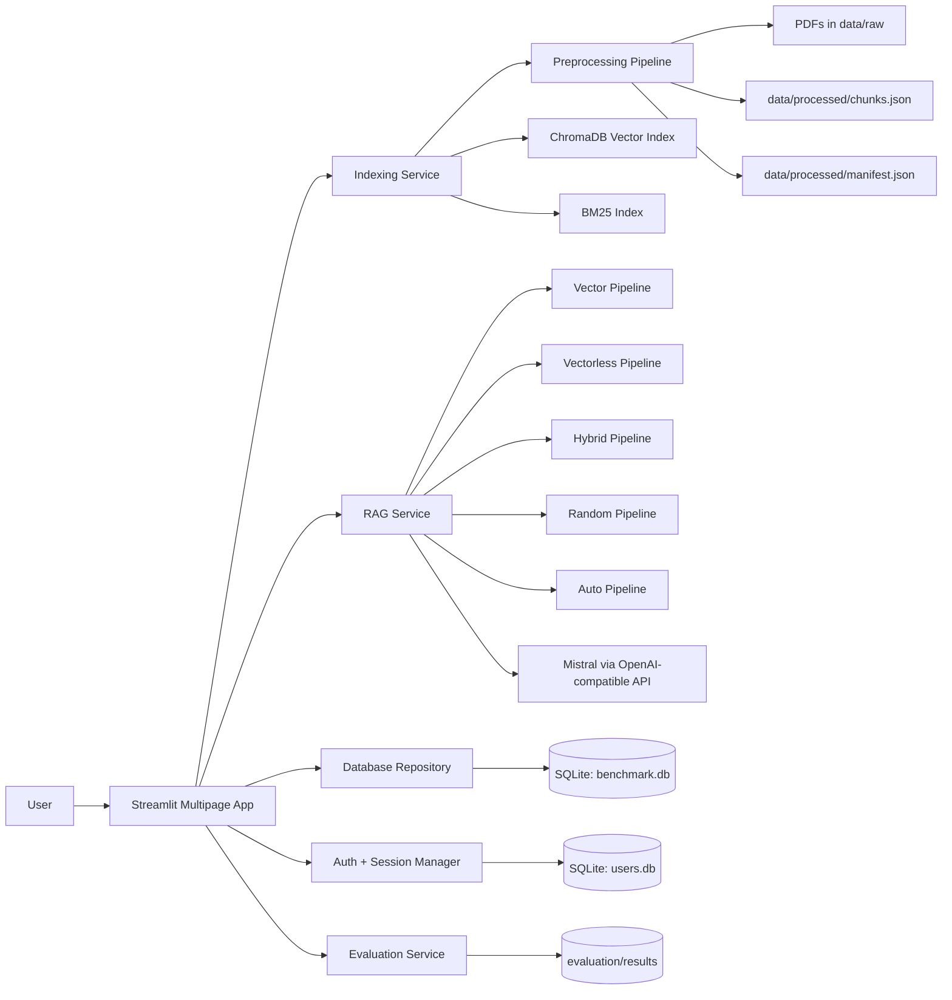
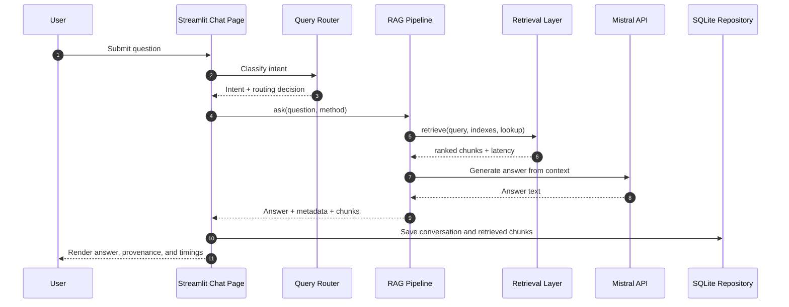

# Financial RAG Benchmark

A Streamlit-based benchmark and research workspace for comparing Vector RAG, BM25-based Vectorless RAG, Hybrid RAG, Random routing, and Auto routing over financial 10-K reports.

[](https://financialragsytem.streamlit.app/)
[](https://www.python.org/)
[](https://streamlit.io/)

# Live Demo

Hosted application:

https://financialragsytem.streamlit.app/

Try the deployed version first, then use the local setup below if you want to run the code or extend the benchmark.

# Table of Contents

- [Overview](#overview)
- [Features](#features)
- [Screenshots](#screenshots)
- [System Architecture](#system-architecture)
- [Technical Architecture](#technical-architecture)
- [Technology Stack](#technology-stack)
- [Project Structure](#project-structure)
- [Workflow](#workflow)
- [RAG Pipeline Deep Dive](#rag-pipeline-deep-dive)
- [Installation](#installation)
- [Environment Variables](#environment-variables)
- [Usage](#usage)
- [API Documentation](#api-documentation)
- [Configuration](#configuration)
- [Performance Optimizations](#performance-optimizations)
- [Security Considerations](#security-considerations)
- [Challenges and Solutions](#challenges-and-solutions)
- [Future Improvements](#future-improvements)
- [Contributing](#contributing)
- [License](#license)
- [Author](#author)

# Overview

## Problem Statement

Financial 10-K reports are long, dense, table-heavy documents. Finding an exact number, a business segment detail, or a risk factor often requires reading many pages and cross-referencing multiple sections. Naive retrieval systems can also return chunks from the wrong company or miss exact financial tokens such as revenue figures, percentages, and fiscal years.

## Motivation

This repository is designed to benchmark RAG strategies on realistic financial QA tasks and to provide a production-style UI for exploring those strategies in one place. It is useful for:

- Comparing retrieval methods on the same questions and documents.
- Studying tradeoffs between semantic retrieval and exact-match lexical search.
- Demonstrating a portfolio-grade, recruiter-friendly AI application.
- Capturing both answer quality and retrieval quality with repeatable evaluation.

## Solution Overview

The project combines:

- A Streamlit multipage app for upload, indexing, chat, conversation review, and evaluation.
- A preprocessing pipeline that extracts PDF text, cleans it, and builds parent-child chunks.
- Three primary retrieval strategies:
  - Vector RAG using ChromaDB + BGE embeddings + cross-encoder reranking.
  - Vectorless RAG using BM25 + a financial-aware tokenizer + reranking.
  - Hybrid RAG using Reciprocal Rank Fusion over vector and BM25 candidates, then reranking.
- Two additional routing modes:
  - Random routing for method comparison.
  - Auto routing based on query classification rules.
- Evaluation tooling that runs a judge benchmark and RAGAS metrics, then stores results in SQLite and CSV files.

The bundled corpus currently covers 7 companies, with 7 source PDFs, 5,841 parent chunks, 20,669 child chunks, a 700-question benchmark set, and a 14-question test subset.

## Business Value

- Reduces manual effort when searching annual reports.
- Surfaces grounded answers with retrieved source chunks.
- Helps compare retrieval methods before choosing a production strategy.
- Supports internal benchmarking and experimentation with financial documents.
- Provides visible evidence of engineering maturity through evaluation artifacts and persisted results.

## User Benefits

- Upload new reports without touching the internals.
- Rebuild vector and BM25 indexes from the UI.
- Ask questions about company filings and inspect the retrieved evidence.
- Review conversation history, retrieved chunks, and benchmark outcomes.
- Switch between retrieval strategies to understand which method works best for a query type.

# Features

## Core Features

- Multipage Streamlit application with a landing page, authentication pages, dashboard, upload manager, index manager, chat interface, conversation browser, and evaluation dashboard.
- Session-based authentication with login, registration, logout, and page protection.
- Role-aware UI that distinguishes between regular users and admin users in the dashboard and conversations views.
- Local persistence for conversations, retrieved chunks, evaluations, system logs, and authentication data.
- Deployment-ready runtime configuration for Python 3.11.

## RAG Features

- Vector RAG pipeline built on ChromaDB with persistent storage and HNSW tuning.
- BM25-based Vectorless RAG pipeline with a financial-aware tokenizer that preserves monetary values, percentages, and years.
- Hybrid RAG pipeline that fuses dense and lexical retrieval candidates using Reciprocal Rank Fusion.
- Cross-encoder reranking using `BAAI/bge-reranker-large`.
- Parent-child chunk retrieval that returns rich parent context while indexing smaller child chunks for precision.
- Company-aware retrieval using query preprocessing and metadata filters.
- Year-aware query preprocessing and semantic query cleanup.
- Fallback retrieval behavior when company filters are too narrow or the index returns weak matches.
- Random retrieval mode for comparative experiments.
- Auto routing mode that selects a retrieval strategy based on query type.

## AI Features

- Answer generation through Mistral via the OpenAI-compatible API.
- Dedicated system prompts for:
  - Financial QA grounded strictly in retrieved context.
  - Structured company overview generation.
  - General chat responses.
- Judge-based evaluation using a separate Mistral key and model path.
- RAGAS evaluation support for answer relevancy, faithfulness, context precision, and context recall.
- Deterministic generation settings for benchmark-style evaluation.

## Search Features

- BGE query prefixing for dense search queries.
- BM25 retrieval that favors exact financial language and token-level matches.
- Reciprocal Rank Fusion to combine semantic and lexical signals.
- Metadata filters by company and year.
- Reranking of candidate chunks before context assembly.
- Guardrails that prevent empty-context prompts from being sent to the LLM.

## Document Processing Features

- PDF text extraction using PyMuPDF and `pymupdf4llm`.
- Markdown-style extraction to preserve tables and document structure better than plain text extraction.
- Text normalization that collapses whitespace and strips boilerplate noise.
- Parent chunk creation at 1000 characters with 100-character overlap.
- Child chunk creation at 300 characters with 50-character overlap.
- Manifest-driven incremental processing that tracks document hashes and reprocesses only changed PDFs.
- Stable parent-child chunk identifiers for safe indexing and lookup.
- Persisted processed artifacts in `data/processed/chunks.json` and `data/processed/manifest.json`.

## User Experience Features

- Modern Streamlit chat UI with `st.chat_input` and `st.chat_message`.
- Sidebar method selection for Hybrid, Vector, Vectorless, Random, and Auto.
- One-click cache clearing for pipeline reloads.
- Expanders for retrieved chunk inspection and raw pipeline output.
- Dashboard charts for document distribution, benchmark comparisons, and system health.
- Conversations page with filtering, search, detail view, chunk drill-down, delete, and CSV export.
- Evaluation dashboard with benchmark execution, leaderboard tables, metric charts, trend charts, and download support.

## Security Features

- Password hashing with `bcrypt`.
- Authentication gate on protected pages.
- Logout flow that clears session variables.
- Separate SQLite database for user credentials.
- API keys loaded from environment variables rather than hardcoded in the runtime config.

## Performance Features

- `st.cache_resource` for reusing loaded pipelines.
- `st.cache_data` for dashboard data and file lookups.
- Persistent ChromaDB collection to avoid repeated index rebuilds.
- BM25 manifest hashing to skip unnecessary reindexing.
- Cached company list extraction from processed chunks.
- Rate limiting for generation and judge calls during benchmarking.
- Batch embedding during vector index creation.
- Small child chunks for high-precision candidate retrieval and larger parent chunks for final LLM context.

## Deployment Features

- Streamlit Community Cloud compatible live deployment.
- `runtime.txt` pinned to Python 3.11.
- `.devcontainer` configuration for local development in a containerized Python 3.11 environment.
- Browser-friendly, page-based app structure that works well in hosted and local environments.

## Repository Extras

- Evaluation notebooks for data exploration, vector RAG, vectorless RAG, hybrid comparison, three-way comparison, and RAGAS benchmarking.
- Finetuning scaffolding for generating verified training pairs from retrieval outputs.
- Utility scripts for chunk integrity checks, BM25 rebuilds, and admin account bootstrapping.
- Generated benchmark charts and CSV results under `evaluation/results/`.

# Screenshots

The repository currently ships with benchmark output charts under `evaluation/results/`, but the app itself would benefit from dedicated UI screenshots. The highest-value captures are:

| Screenshot | Why it matters | Suggested path |
| --- | --- | --- |
| Landing page | Shows the product positioning, live stats, and navigation. | `docs/screenshots/home.png` |
| Dashboard | Shows dataset scale, company distribution, and benchmark leaderboard. | `docs/screenshots/dashboard.png` |
| Upload and Index Manager | Shows document ingestion and index management workflows. | `docs/screenshots/indexing.png` |
| Chat view | Shows retrieval method selection, answer generation, retrieved chunks, and raw output. | `docs/screenshots/chat.png` |
| Conversation detail | Shows persisted chats, chunk provenance, and deletion/export controls. | `docs/screenshots/conversations.png` |
| Evaluation dashboard | Shows the judge benchmark, RAGAS results, and charts. | `docs/screenshots/evaluation.png` |

Existing visual artifacts already in the repo:

- `evaluation/results/chart1_overall.png`
- `evaluation/results/chart2_by_category.png`
- `evaluation/results/chart3_by_company.png`
- `evaluation/results/chart4_latency.png`
- `evaluation/results/chart5_distribution.png`
- `evaluation/results/three_way_chart_overall.png`
- `evaluation/results/three_way_chart_latency.png`
- `evaluation/results/three_way_chart_company.png`
- `evaluation/results/three_way_chart_category_heatmap.png`
- `evaluation/results/three_way_chart_difficulty_heatmap.png`
- `evaluation/results/three_way_chart_distribution.png`

# System Architecture

## High-Level Architecture



## Component Interaction Flow

- The user interacts with Streamlit pages.
- Authentication is handled in the `streamlit_app.auth` package.
- Uploads are written to `data/raw`.
- Preprocessing converts PDFs into structured parent and child chunks.
- Vector and BM25 indexes are built from the processed chunks.
- Chat requests are routed through `streamlit_app.services.rag_service`.
- The selected retrieval pipeline returns retrieved chunks and latency metrics.
- The LLM formats the final answer from retrieved context.
- Conversations and retrieval evidence are stored in SQLite.
- Evaluation runs persist benchmark summaries and visual outputs.

## End-to-End Request Lifecycle



## Data Flow Explanation

- Raw PDFs are stored under `data/raw`.
- Preprocessing extracts page text and normalizes it into parent and child chunks.
- `manifest.json` tracks PDF hashes and processing metadata.
- `chunks.json` stores parent and child chunk records, including parent-child relationships.
- ChromaDB stores child chunks for dense retrieval.
- BM25 stores tokenized children in a pickle index for lexical retrieval.
- The retriever converts child hits back into parent chunks before LLM generation.
- Conversation metadata, retrieval traces, and benchmark results are persisted separately in SQLite.

# Technical Architecture

## Frontend

- Built with Streamlit multipage navigation.
- Uses `st.chat_input`, `st.chat_message`, `st.metric`, `st.dataframe`, `st.bar_chart`, and Plotly charts.
- Uses session state to preserve the current user, session ID, selected method, and chat history.

## Backend

- Pure Python service layer without a separate FastAPI or Flask server.
- SQLite repository layer for persistence.
- Utility services for indexing, RAG orchestration, document metadata, company summaries, and evaluation.

## AI Layer

- Mistral is used for answer generation and benchmark judging through the OpenAI-compatible client.
- System prompts constrain the model to answer only from retrieved context.
- The judge model is used to score answers on a 1-5 scale during benchmark runs.

## Retrieval Layer

- Vector retrieval uses ChromaDB + BGE embeddings.
- Lexical retrieval uses BM25 with a financial tokenizer.
- Hybrid retrieval combines both signals using Reciprocal Rank Fusion.
- Cross-encoder reranking sorts candidate chunks by relevance before context assembly.

## Embedding Layer

- Dense embeddings use `BAAI/bge-large-en-v1.5`.
- Reranking uses `BAAI/bge-reranker-large`.
- Query text is prefixed with a BGE retrieval instruction before dense search.

## Storage Layer

- `storage/benchmark.db` stores conversations, retrieved chunks, evaluations, and system logs.
- `storage/users.db` stores login credentials and roles.
- `vector_rag/chroma_db/` stores the persistent vector index.
- `vectorless_rag/bm25_index.pkl` and `vectorless_rag/bm25_manifest.json` store the BM25 index state.
- `data/processed/chunks.json` and `data/processed/manifest.json` store processed document artifacts.

## Deployment Layer

- Streamlit Community Cloud hosts the public demo.
- `.devcontainer/devcontainer.json` supports reproducible local development.
- `runtime.txt` pins the Python version used by cloud builds.

# Technology Stack

## Frontend

| Component | Implementation | Notes |
| --- | --- | --- |
| App framework | Streamlit | Multipage UI with chat, dashboard, and admin pages. |
| Visualization | Plotly, Streamlit charts | Used for radar charts, line charts, and bar charts. |
| Tabular UI | Pandas + `st.dataframe` | Used throughout dashboard and analytics pages. |

## Backend

| Component | Implementation | Notes |
| --- | --- | --- |
| Language | Python 3.11 | Pinned in `runtime.txt` and devcontainer. |
| App orchestration | Streamlit service layer | `rag_service`, `indexing_service`, `evaluation_service`. |
| Persistence | SQLite | Local database for auth, conversations, evaluations, and logs. |
| File processing | PyMuPDF, `pymupdf4llm` | PDF text extraction and markdown-style page parsing. |

## AI / ML

| Component | Implementation | Notes |
| --- | --- | --- |
| Answer generation | Mistral via `openai.OpenAI` | OpenAI-compatible endpoint configured in `llm.py`. |
| Judge model | Mistral via `openai.OpenAI` | Separate key and rate limit for evaluation. |
| Dense embeddings | `BAAI/bge-large-en-v1.5` | Used by ChromaDB embedding function. |
| Reranker | `BAAI/bge-reranker-large` | CrossEncoder reranker for candidate sorting. |
| Evaluation | RAGAS | Computes answer relevancy, faithfulness, context precision, context recall. |
| Supporting libraries | `sentence-transformers`, `transformers`, `torch`, `accelerate`, `einops` | Used by embeddings, reranking, and evaluation tooling. |

## Databases

| Component | Implementation | Notes |
| --- | --- | --- |
| App database | SQLite `benchmark.db` | Stores chats, retrieval evidence, evaluations, and logs. |
| Auth database | SQLite `users.db` | Stores user profiles and hashed passwords. |
| Evaluation artifacts | CSV + PNG files | Stored in `evaluation/results/`. |

## Vector Databases

| Component | Implementation | Notes |
| --- | --- | --- |
| Vector store | ChromaDB PersistentClient | Stores child chunks for dense retrieval. |
| ANN index | HNSW | Tuned with `M=32`, `construction_ef=200`, and `search_ef=100`. |
| Similarity metric | Cosine | Configured at collection creation time. |
| Lexical index | BM25 | Stored in a pickle file with a manifest hash. |

## Deployment

| Component | Implementation | Notes |
| --- | --- | --- |
| Hosted demo | Streamlit Community Cloud | Public URL is linked above. |
| Local dev container | `devcontainer.json` | Starts the app on port 8501. |
| Runtime pin | `runtime.txt` | Python 3.11. |

## Dev Tools

| Component | Implementation | Notes |
| --- | --- | --- |
| Notebook workflow | Jupyter, ipykernel | Used for exploration, comparison, and evaluation notebooks. |
| Progress and CLI UX | `tqdm` | Used in preprocessing and benchmark runs. |
| Environment loading | `python-dotenv` | Loads API keys from `.env`. |
| Testing and scripts | `check_chunks.py`, `test.py`, `create_admin.py` | Utility scripts for maintenance and local bootstrapping. |
| Finetuning prep | `finetuning/training/generate_training_pairs.py` | Produces verified training pairs from retrieval outputs. |

# Project Structure

```text
.
├── app.py
├── config.py
├── data_loader.py
├── llm.py
├── reranker.py
├── create_admin.py
├── check_chunks.py
├── test.py
├── vector_rag/
├── vectorless_rag/
├── hybrid_rag/
├── random_rag/
├── auto_rag/
├── query_router/
├── utils/
├── streamlit_app/
│   ├── auth/
│   ├── database/
│   └── services/
├── pages/
├── evaluation/
│   ├── evaluator.py
│   ├── ragas_evaluator.py
│   ├── test_questions.json
│   └── results/
├── data/
│   ├── raw/
│   └── processed/
├── storage/
├── notebooks/
├── finetuning/
│   └── training/
├── runtime.txt
├── requirements.txt
└── .devcontainer/
```

## Major Directories

- `pages/`: Streamlit multipage UI for auth, dashboard, upload, indexing, chat, conversations, and evaluations.
- `streamlit_app/`: Shared service, database, and auth code used by the pages.
- `vector_rag/`: Dense retrieval pipeline, ChromaDB indexer, and vector retriever.
- `vectorless_rag/`: BM25 indexer, tokenizer, and lexical retriever.
- `hybrid_rag/`: RRF fusion logic that combines vector and BM25 results.
- `auto_rag/`: Query-type classifier and automatic pipeline routing rules.
- `random_rag/`: Random method selector for experimentation.
- `query_router/`: Intent classifier for chat, metadata, document exploration, and evaluation queries.
- `evaluation/`: Benchmarking code, test question sets, and generated result artifacts.
- `data/`: Raw PDFs and processed chunk artifacts.
- `storage/`: SQLite databases for app state and authentication.
- `finetuning/`: Training-pair generation workflow for experimentation.
- `notebooks/`: Exploratory analysis, comparison, and benchmarking notebooks.

# Workflow

## Chat Workflow

1. The user submits a question from the Chat page.
2. The query router classifies the intent as chat, document question, document metadata, document exploration, or evaluation exploration.
3. If the question is not document-related, the app falls back to general chat mode.
4. For document questions, the selected method is loaded from the cached pipeline layer.
5. The query processor detects company names and years, then cleans the query for retrieval.
6. The retrieval layer fetches candidate chunks from ChromaDB, BM25, or both.
7. The reranker scores candidates with a cross-encoder.
8. Parent chunks are assembled into a context string.
9. Mistral generates a grounded answer using the context.
10. The conversation, retrieval traces, and chunk evidence are stored in SQLite.
11. The UI renders the answer, timings, retrieved chunks, and raw pipeline output.

## Indexing Workflow

1. PDFs are uploaded to `data/raw`.
2. The preprocessing pipeline extracts page text with markdown-aware parsing.
3. The text is normalized and split into parent and child chunks.
4. The manifest is updated with file hashes and processing metadata.
5. The chunk dataset is written to `data/processed/chunks.json`.
6. ChromaDB indexes child chunks for dense retrieval.
7. BM25 indexes the same child chunks for lexical retrieval.
8. The Chat page can now use the new indexes immediately after cache refresh.

## Evaluation Workflow

1. The evaluation dashboard loads the benchmark question set.
2. Each retrieval method answers the same questions.
3. The judge model scores answer quality.
4. RAGAS computes retrieval and grounding metrics when requested.
5. Results are written to CSV and persisted in SQLite.
6. The dashboard renders leaderboards, metric tables, trend charts, and downloads.

# RAG Pipeline Deep Dive

## Document Ingestion

- Source documents are PDFs stored in `data/raw`.
- The preprocessing pipeline scans for new or changed PDFs using an MD5 manifest hash.
- Existing processed chunks are preserved unless the source file changed.
- The pipeline is incremental, so only modified documents are reprocessed.

## Chunking Strategy

- Each PDF page is extracted into markdown-like text using `pymupdf4llm`.
- Pages with very little text are skipped.
- Parent chunks use `CHILD` and `PARENT` constants from `config.py`:
  - Parent size: 1000 characters.
  - Parent overlap: 100 characters.
  - Child size: 300 characters.
  - Child overlap: 50 characters.
- Children are indexed; parents are used for context passed to the LLM.
- Each child stores a `parent_id` so the retriever can restore the broader context later.

## Embedding Generation

- Dense embeddings are generated by ChromaDB's `SentenceTransformerEmbeddingFunction`.
- The configured model is `BAAI/bge-large-en-v1.5`.
- Queries are prefixed with the BGE retrieval instruction string before dense search.
- Documents are stored without the query prefix.

## Vector Storage

- ChromaDB is used as the persistent vector store.
- The collection uses cosine distance and HNSW parameters tuned for recall.
- Child chunk metadata includes source file, company, page, parent ID, and chunk type.

## Retrieval Strategy

### Vector RAG

- Query preprocessing detects the company and year.
- The query is searched in ChromaDB using a company filter when possible.
- The retriever falls back to a broader search if the filtered result set is too small.
- Candidate child chunks are reranked, then swapped back to their parent chunks.

### Vectorless RAG

- The query is tokenized with a financial-aware tokenizer.
- BM25 is rebuilt on the relevant subset when a company is detected.
- Candidates are reranked and mapped back to parent chunks before generation.

### Hybrid RAG

- Dense search and BM25 search run in parallel.
- Reciprocal Rank Fusion merges the ranked lists using rank positions, not raw scores.
- The fused candidate pool is reranked with the cross-encoder.
- Final parent chunks are returned to the generator.

## Similarity Search

- Dense retrieval uses cosine similarity on BGE embeddings.
- BM25 uses exact token overlap and IDF weighting.
- RRF keeps both signals meaningful even though their numeric scales differ.

## Context Augmentation

- Retrieved child chunks are replaced with parent chunks for richer context.
- The formatting layer labels each chunk with source company and page number.
- When child and parent texts differ, the broader parent text is included for clarity.

## Response Generation

- The financial QA prompt forces the model to answer only from context.
- Company overview requests are structured into:
  - Company Overview
  - Business Segments
  - Products and Services
  - Revenue Drivers
  - Strategic Priorities
  - Key Risks
- If the answer is not found, the model returns a fixed fallback response rather than inventing facts.

# Installation

## Prerequisites

- Python 3.11
- A Mistral API key for answer generation
- A separate Mistral key for evaluation judging
- Optional Hugging Face token for model downloads if needed in your environment

## Setup

```bash
git clone <your-repo-url>
cd rag-benchmark

python -m venv .venv
.venv\Scripts\Activate.ps1

pip install --upgrade pip
pip install -r requirements.txt
```

## Environment File

Create a `.env` file in the project root with the keys listed in the next section.

## Run the App

```bash
streamlit run app.py
```

## Initial Workflow

1. Register a user account from the app.
2. Log in.
3. Upload PDF reports on the Upload Documents page.
4. Run preprocessing.
5. Build the Vector, BM25, or All indexes from the Index Manager.
6. Open the Chat page and start asking questions.

# Environment Variables

| Variable | Description | Required | Example Value |
| --- | --- | --- | --- |
| `MISTRAL_API_KEY` | API key used for normal answer generation. | Yes | `mistral_live_...` |
| `MISTRAL_JUDGE_API_KEY` | Separate API key used by the judge benchmark and RAGAS wrapper. | Yes for evaluation | `mistral_eval_...` |
| `HF_TOKEN` | Optional Hugging Face token for gated model downloads or authenticated access. | Optional | `hf_xxxxxxxxxxxxx` |

Notes:

- `MISTRAL_BASE_URL` is currently hardcoded to `https://api.mistral.ai/v1` in `config.py`.
- No other environment variables are read by the runtime code at the moment.

# Usage

## Launch the Application

1. Start the Streamlit app locally or open the live demo.
2. Register and log in.
3. Use the left sidebar or page navigation to move between app sections.

## Upload and Prepare Documents

1. Go to `Upload Documents`.
2. Upload one or more PDF annual reports.
3. Save the uploaded files into `data/raw`.
4. Run preprocessing to produce `chunks.json` and `manifest.json`.

## Build Retrieval Indexes

1. Go to `Index Manager`.
2. Build the Vector index, BM25 index, or both.
3. Wait for the progress indicators to finish.
4. Reload the Chat page if you changed the index state.

## Ask Questions

1. Open `Chat`.
2. Choose a retrieval method:
   - Hybrid
   - Vector
   - Vectorless
   - Random
   - Auto
3. Ask a question about one of the supported companies or a general question.
4. Review the answer, retrieved chunks, timings, and raw pipeline output.

## Inspect Conversations

1. Open `Conversations`.
2. Filter by method or search by text.
3. Open a conversation to view the question, answer, metadata, and retrieved evidence.
4. Export the filtered set as CSV if needed.

## Run Evaluations

1. Open `Evaluations`.
2. Run the judge benchmark to score the active retrieval methods.
3. Run RAGAS after the judge results are available.
4. Review the leaderboard, charts, and downloadable CSV outputs.

## Use the Route Helpers Programmatically

The app also exposes internal service functions for scripted usage:

- `streamlit_app.services.rag_service.ask_question(...)`
- `streamlit_app.services.indexing_service.preprocess_documents()`
- `streamlit_app.services.indexing_service.build_all_indexes()`
- `evaluation.evaluator.run_evaluation(...)`
- `evaluation.ragas_evaluator.run_ragas_evaluation(...)`

# API Documentation

## Public HTTP API

There is no separate public REST or GraphQL API in this repository. The user-facing surface is the Streamlit multipage app.

## Streamlit Routes

| Route / Page | Method | Purpose | Response |
| --- | --- | --- | --- |
| `app.py` | UI page | Landing page, status checks, quick stats, and navigation guide. | Streamlit view. |
| `pages/00_register.py` | UI page | Create a local account. | Session redirect to login on success. |
| `pages/00_login.py` | UI page | Authenticate a user. | Session redirect to dashboard on success. |
| `pages/01_dashboard.py` | UI page | Show dataset stats, evaluation summaries, and recent chats. | Streamlit dashboard view. |
| `pages/02_upload_documents.py` | UI page | Upload and preprocess PDFs. | Status messages and rerun. |
| `pages/03_index_manager.py` | UI page | Build or delete retrieval indexes. | Status messages and rerun. |
| `pages/04_chat.py` | UI page | Ask questions using the selected retrieval method. | Answer, retrieved chunks, and stored conversation. |
| `pages/05_conversations.py` | UI page | Browse, inspect, delete, and export conversations. | Streamlit analytics view. |
| `pages/06_evaluations.py` | UI page | Run judge and RAGAS benchmarks. | Leaderboard, charts, and downloadable results. |

## Internal Python APIs

| Callable | Inputs | Output | Purpose |
| --- | --- | --- | --- |
| `streamlit_app.services.rag_service.ask_question(question, method)` | Query string and selected method. | Result dictionary with answer, retrieval metadata, and intent. | Routes query handling and invokes the proper pipeline. |
| `streamlit_app.services.rag_service.get_pipeline(method)` | Method name. | Cached pipeline instance. | Loads Vector, Vectorless, Hybrid, Random, or Auto pipeline objects. |
| `streamlit_app.services.indexing_service.preprocess_documents()` | None. | Status dictionary. | Runs PDF preprocessing and chunk generation. |
| `streamlit_app.services.indexing_service.build_all_indexes()` | None. | Status dictionary. | Rebuilds both vector and BM25 indexes. |
| `evaluation.evaluator.run_evaluation(...)` | Pipelines and optional context capture flag. | Pandas DataFrame and optional context map. | Runs judge benchmark scoring. |
| `evaluation.ragas_evaluator.run_ragas_evaluation(...)` | Judge DataFrame and context map. | RAGAS score DataFrame. | Computes RAGAS metrics and saves CSV output. |

# Configuration

## Key Runtime Settings

| Setting | Value | Purpose |
| --- | --- | --- |
| `LLM_MODEL_ID` | `mistral-medium-latest` | Main answer generation model. |
| `JUDGE_MODEL_ID` | `mistral-medium-latest` | Judge model used during evaluation. |
| `EMBEDDING_MODEL` | `BAAI/bge-large-en-v1.5` | Dense retrieval embedding model. |
| `RERANKER_MODEL` | `BAAI/bge-reranker-large` | Cross-encoder reranker. |
| `CHILD_CHUNK_SIZE` | `300` | Child chunk size for indexing. |
| `CHILD_CHUNK_OVERLAP` | `50` | Child chunk overlap. |
| `PARENT_CHUNK_SIZE` | `1000` | Parent chunk size for context generation. |
| `PARENT_CHUNK_OVERLAP` | `100` | Parent chunk overlap. |
| `TOP_K` | `5` | Final number of chunks returned after reranking. |
| `FETCH_K` | `15` | Candidate pool size before reranking. |
| `HNSW_M` | `32` | ChromaDB graph connectivity setting. |
| `HNSW_CONSTRUCTION_EF` | `200` | Build-time search depth for HNSW. |
| `HNSW_SEARCH_EF` | `100` | Query-time search depth for HNSW. |
| `MISTRAL_RPM` | `18` | Generation rate limit during evaluation. |
| `MISTRAL_JUDGE_RPM` | `12` | Judge rate limit during evaluation. |
| `MAX_NEW_TOKENS` | `512` | Max answer length for normal generation. |
| `JUDGE_MAX_TOKENS` | `180` | Max response length for judge scoring. |
| `TEMPERATURE` | `0.0` | Deterministic normal generation. |
| `JUDGE_TEMPERATURE` | `0.0` | Deterministic judge scoring. |

## Known Companies

The retriever and router currently recognize these companies from the codebase and processed dataset:

- Amazon
- ASUS
- Coca-Cola
- Microsoft
- Netflix
- NVIDIA
- Reliance

## Data and Artifact Paths

| Path | Purpose |
| --- | --- |
| `data/raw/` | Uploaded source PDFs. |
| `data/processed/chunks.json` | Parent and child chunk store. |
| `data/processed/manifest.json` | PDF processing manifest and hashes. |
| `vector_rag/chroma_db/` | Persistent ChromaDB vector index. |
| `vectorless_rag/bm25_index.pkl` | Serialized BM25 index. |
| `vectorless_rag/bm25_manifest.json` | BM25 rebuild manifest. |
| `evaluation/results/` | CSV results and generated benchmark charts. |
| `storage/benchmark.db` | Main SQLite database. |
| `storage/users.db` | Authentication database. |

# Performance Optimizations

- `st.cache_resource` keeps retrieval pipelines alive across reruns, which avoids reloading models and indexes repeatedly.
- `st.cache_data` reduces repeated dashboard file reads and aggregation work.
- ChromaDB uses a persistent collection and tuned HNSW parameters for retrieval speed and recall.
- BM25 indexing is skipped when the manifest hash matches the current children set.
- Query preprocessing strips the company name from the search text when appropriate, which improves search focus.
- Hybrid retrieval only fuses ranked candidates, so the LLM sees a compact, high-signal context window.
- Reranking is applied after a limited fetch stage to keep cross-encoder cost manageable.
- Evaluation uses rate limiting to keep Mistral calls under control.
- Chunk sizes are intentionally asymmetric so the index stays precise while the prompt context stays rich.

# Security Considerations

- Passwords are hashed with `bcrypt` before storage.
- Protected pages call `require_login()` and redirect unauthenticated users to the login page.
- User session variables are cleared on logout.
- Mistral keys are loaded from `.env` instead of being embedded directly in the source.
- Uploaded PDFs are written to the local filesystem under `data/raw`, so deployments should control file access and storage policy carefully.
- The current app uses local SQLite databases and does not include a production identity provider, row-level authorization layer, or encrypted secret store.
- Input validation is lightweight and mostly UI-driven, so a production hardening pass should add stronger file validation, size limits, and safer admin bootstrap handling.

# Challenges and Solutions

- Large financial PDFs are difficult to extract cleanly. The preprocessing pipeline uses markdown-aware PDF parsing and text cleanup to preserve structure better than plain extraction.
- Exact financial values are easy to miss with embeddings alone. The vectorless pipeline adds BM25 with a tokenizer that preserves dollars, percentages, and years.
- Semantic search can drift to the wrong company. The retrievers use company detection, metadata filters, and fallback logic to keep results on target.
- Parent-child indexing can silently break if chunk IDs collide across files. The preprocessing pipeline now maintains globally unique IDs for both parents and children.
- Dense retrieval quality depends on the BGE instruction format. The code prefixes queries with the required retrieval instruction before vector search.
- Benchmarking many questions against multiple methods can hit API limits. The evaluation layer uses explicit rate limiting and reusable judge/client setup.
- Streamlit reruns can be expensive. The app caches pipelines and shared data so repeated navigation stays responsive.

# Future Improvements

- Add a dedicated REST API if external programmatic access becomes a requirement.
- Introduce background jobs for preprocessing, indexing, and evaluation runs.
- Add OCR fallback for scanned or image-only PDFs.
- Add richer citation rendering, source highlighting, and chunk-level citations in the chat UI.
- Replace ad-hoc local SQLite auth with a more scalable identity layer.
- Add automated tests for retrieval, preprocessing, routing, and database writes.
- Add stronger upload validation, file size limits, and security checks.
- Normalize and pin the dependency list more strictly.
- Add migrations for schema evolution instead of relying on implicit local database shape.
- Add observability for latency, token usage, retrieval quality, and errors.
- Add document-level filters, category filters, and richer metadata search.

# Contributing

Contributions are welcome. If you want to extend the project:

1. Fork or branch from the main repository.
2. Keep changes focused and document any new behavior.
3. Update the relevant Streamlit page, service layer, or retrieval pipeline.
4. Validate preprocessing and indexing flows after any document pipeline change.
5. If you change evaluation behavior, regenerate benchmark outputs and update the README where needed.
6. Open a pull request with a clear summary of the architectural or user-facing impact.

Suggested contribution areas:

- New retrieval strategies.
- Better evaluation automation.
- UI polish and visualization improvements.
- Testing and validation coverage.
- Deployment hardening.

# License

No license file is currently present in the repository.

Until a license is added, the project should be treated as all rights reserved.

# Author

Prajit Ramachandran

Repository authorship is inferred from the git history available in this workspace.
